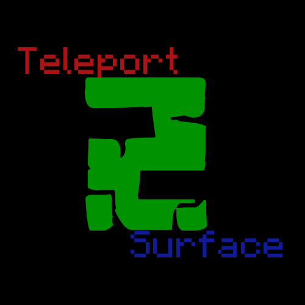

[![Contributors][contributors-shield]][contributors-url]
[![Forks][forks-shield]][forks-url]
[![Stargazers][stars-shield]][stars-url]
[![Issues][issues-shield]][issues-url]

  <a href="https://github.com/bogdanbeyn/teleport2surface">
    <!--  -->
  </a>

  <h3 align="center">Teleport2Surface</h3>

  

    You won't die if your friend is stuck in the block
    <i>(or swimming in lava in a cave)</i>
     
     
    <a href="https://github.com/bogdanbeyn/teleport2surface">View Demo</a>
    ·
    <a href="https://github.com/bogdanbeyn/teleport2surface/issues">Report Bug</a>
    ·
    <a href="https://github.com/bogdanbeyn/teleport2surface/issues">Request Feature</a>
  

 
 
 

## Usage
Use **/surface** to teleport to the most safe block on your friend's location.

_Aliases:_
 - surf
 - teleport

## License
Distributed under the MIT License. <a href="https://github.com/bogdanbeyn/teleport2surface/blob/b317768e98ef1e4e61db7595ee6b7ef3b782519e/LICENSE.txt">More information about this license</a>.

[contributors-shield]: https://img.shields.io/github/contributors/CodedRed-Spigot/Bookshelf-Storage.svg?style=for-the-badge
[contributors-url]: https://github.com/bogdanbeyn/teleport2surface/graphs/contributors
[forks-shield]: https://img.shields.io/github/forks/bogdanbeyn/teleport2surface.svg?style=for-the-badge
[forks-url]: https://github.com/bogdanbeyn/teleport2surface/network/members
[stars-shield]: https://img.shields.io/github/stars/bogdanbeyn/teleport2surface.svg?style=for-the-badge
[stars-url]: https://github.com/bogdanbeyn/teleport2surface/stargazers
[issues-shield]: https://img.shields.io/github/issues/bogdanbeyn/teleport2surface.svg?style=for-the-badge
[issues-url]: https://github.com/bogdanbeyn/teleport2surface/issues
